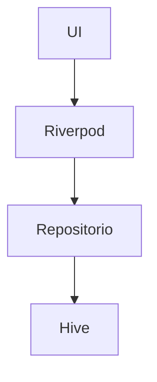

# Arquitetura do SuperLista

## Visão Geral
O SuperLista é um aplicativo Flutter em **Clean Archtecture**, dividido em três camadas principais:
- **Domain**: Regras de negócio e modelos.
- **Data**: Persistência e repositórios.
- **Presentation**: Interface do usuário e lógica de estado.

---

## Tecnologias
- Flutter 3.35.7
- Riverpod para gerenciamento de estado.
- Hive para persistência offline.
- Firebase (planejado para compartilhamento e notificações).

## Diagrama de Componentes

---

## Justificativa das Escolhas
- **Riverpod**: Melhor escalabilidade e testabilidade.
- **Hive**: Banco local rápido e sem dependência de SQL.
- **Flutter**: Multiplataforma com alta performance.